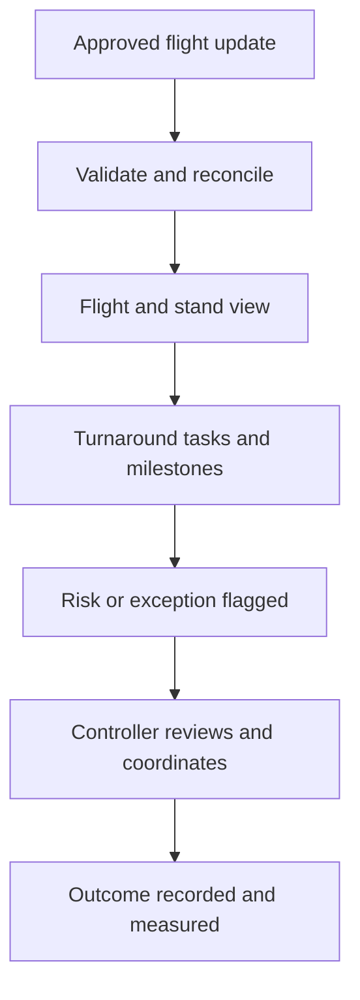

# AeroOps — Solution Intent

**Version:** 1.0  
**Date:** 29 September 2026  
**Status:** Proposed; validate with the pilot airport and operational partners  
**Companion documents:** `AEROOPS_PROJECT_PLAN.md`, `AEROOPS_SYSTEM_DESIGN.md`, `AEROOPS_IMPLEMENTATION_PLAN.md`

## 1. Purpose

AeroOps is an airport operations intelligence and collaboration platform. It brings approved flight, stand and turnaround information into one current view so an Airport Operations Control Centre (AOCC) and its partners can spot problems, coordinate responses and understand what happened. It complements existing airport systems and leaves operational authority with the designated people and systems.

**Product statement:** Give airport teams a trustworthy shared view of each flight and turnaround, explain exceptions early, and help authorized people act before avoidable delays compound.

## 2. Problem and opportunity

Airport operations span the airport operator, airlines, ground handlers and other partners. Their updates often arrive through separate systems and at different times. A controller may need to compare a flight feed, stand board, handler update and telephone call to determine whether a turnaround remains feasible. Missing or conflicting information can hide a stand conflict or late service task until intervention is difficult.

The initial opportunity is a common operational timeline with visible source, timestamp and freshness for every important update; explicit ownership of exceptions; and simple, explainable alerts. AeroOps should reduce time spent assembling the picture and improve coordination. Any measured impact on departure punctuality must be demonstrated in a pilot rather than assumed.

## 3. Intended users and decisions

| User | Decision supported | Typical view or action |
|---|---|---|
| AOCC controller | Which flights need intervention now? | Flight board, at-risk turnaround list, exception ownership |
| Stand planner | Are assignments feasible, and where is a conflict? | Stand occupancy and overlapping-window warning |
| Ground-handler supervisor | Which tasks are late or unassigned? | Team workload and task escalation |
| Ramp agent | What task should I update, and by when? | Focused mobile web task list |
| Airline liaison | What has changed on this flight? | Timeline, source and estimated readiness |
| Operations manager | What patterns need process improvement? | KPIs, audit and post-operation analysis |
| Auditor/security administrator | Who saw or changed a record? | Access controls, action history and data lineage |

## 4. Pilot outcome and boundaries

The first pilot at **one airport** follows a defined set of flights from an inbound update through on-block, stand occupancy, parallel turnaround tasks, readiness and off-block. Staff can report incidents, resolve exceptions and see when a source is stale. A narrow, approved feed and authorized manual updates supply the data. Simulated data remains available for development and rehearsal.

### Included in the MVP

1. Flight list, detail, status and source lineage.
2. Stand occupancy and conflict warnings with human resolution.
3. Configurable turnaround milestones and task ownership.
4. Incident and exception assignment, escalation and audit history.
5. AOCC dashboard and mobile web task updates.
6. Data ingestion, validation, deduplication, replay and freshness monitoring.
7. Role and tenant scoped access, audit records and operational alerts.
8. Explainable, rule-based delay-risk indications; an optional read-only copilot behind a feature flag after security review.

### Outside the MVP

ATC or aircraft control; runway and safety-critical commands; autonomous stand assignment or external-system writeback; passenger-level or baggage-level identity data; comprehensive baggage, security, cargo, maintenance and IoT modules; native mobile apps; predictive ML that acts on its own; and a claim of formal A-CDM compliance. These require separate business cases, interfaces and approvals.

## 5. Operating principles

- **The source of truth stays explicit.** The AODB, resource system or designated partner owns its authoritative fields. AeroOps records the source and never silently overrides a correction.
- **Humans control consequential changes.** Alerts and AI output advise; a person with appropriate authority approves operational actions through the applicable workflow.
- **Uncertainty is visible.** Show planned, estimated and actual times separately. Show the last update and suppress confident recommendations when a feed is stale.
- **Each airport is isolated and configurable.** Airport-specific rules, stands, task templates, sources, roles and retention policies are configuration; cross-tenant access is denied by design and tested.
- **Build one working flow before expanding.** Deliver the complete flight-to-off-block journey with a real operator, then add partners and modules.
- **Keep a manual fallback.** Airport teams must be able to use established procedures during a platform or feed outage.

## 6. Target workflow

An inbound event is authenticated, checked against its contract and mapped to an airport tenant. The system stores the original event and applies it idempotently to a canonical flight. Stand assignments and task updates update the timeline. A rule may flag an overlapping stand window or an overdue task, with the evidence shown to a controller. The controller assigns an owner, coordinates outside or inside AeroOps as permitted, and records the outcome. Later corrections remain traceable.

## 7. Proposed solution shape

A modular backend serves a web AOCC interface and mobile-friendly task screens. Adapters normalize approved partner feeds into versioned events. PostgreSQL stores operational state, event identity and audit records. Identity uses OIDC with role, airport and organization scope. Dashboards read governed application APIs. The optional copilot can call only approved, read-only operational queries under the requesting user's permissions; answers include sources and freshness.

The pilot favors a modular deployable application over early microservice fragmentation. Broker, warehouse and ML infrastructure can be introduced when measured throughput or use cases justify them. Hosting location, tenancy arrangement, identity federation and data retention remain subject to the airport's security and legal review.

## 8. Outcomes and measures

| Outcome | Pilot measure | Initial target or decision rule |
|---|---|---|
| Timely shared view | Accepted events visible within 30 seconds | At least 95% at agreed pilot load |
| Trustworthy flight record | Sampled fields matched to authoritative source | At least 99% for agreed fields |
| Usable turnaround record | Required milestones completed | Baseline and improvement target agreed with handler |
| Actionable alerts | Controller-confirmed useful alerts | Threshold agreed after first shadow week |
| Reliable service | Availability during agreed pilot hours | At least 99.5% |
| Safe access | Cross-tenant disclosure in tests | Zero |
| Accountable operation | Changes to stands, tasks and incidents audited | 100% of supported mutations |

Targets are proposed acceptance criteria, not claims about current airport performance. Establish definitions and baselines during discovery. Record false alerts, missing events, latency, user adoption and incident response alongside any punctuality measures.

## 9. Delivery intent and gates

The working baseline is a 24-week path: discovery and contracts (weeks 1–4), foundation (5–7), operational core (8–11), approved integration and AOCC interface (12–14), hardening and readiness (15–18), bounded shadow pilot (19–22), and evaluation (23–24). Gates require sponsor and access confirmation, approved data contracts, integrated security testing, fallback rehearsal, and airport operational sign-off. If live access is delayed, development continues on synthetic feeds while the live pilot gate moves.

## 10. Key assumptions and unresolved decisions

- A pilot airport, sponsor, AOCC owner and ground-handler representative will be named.
- Data owners will authorize at least one representative flight/stand or turnaround feed and agree an interface contract.
- The airport will identify the authoritative system for flight and stand fields and define who may correct them.
- Stand compatibility rules, milestone vocabulary, service targets and escalation paths will be supplied by local operations.
- Security, privacy, residency and safety owners will review the specific deployment before live use.
- Budget, cloud provider and commercial model will be decided after the first airport's integration and hosting constraints are known.

## 11. Definition of success

AeroOps is ready for broader rollout when the pilot team can complete a representative operational day with trustworthy flight and turnaround status, clearly assigned exceptions, recoverable and secure service, auditable decisions, and evidence that staff find the shared picture useful. Expansion to additional airports or automated recommendations requires a separate review of the pilot results and local operating rules.
