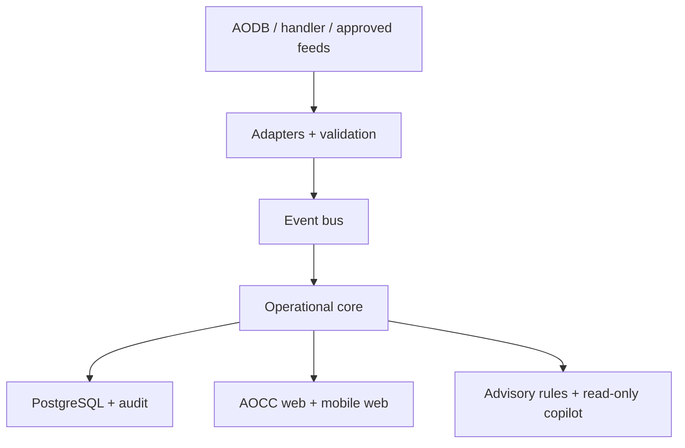

# AeroOps — System Design Document

**Version:** 1.0 | **Date:** 29 September 2026 | **Status:** Proposed architecture for discovery validation

## 1. Design intent and boundaries

AeroOps consumes permitted operational feeds and operator updates to provide a shared airport view. It does not control aircraft, ATC, runway operations, or safety systems. The authoritative AODB/resource system remains the owner of its records. External writeback requires a later, separately approved design and safety assessment.

Actors: AOCC controller, stand planner, ground-handler supervisor/agent, airline liaison, airport administrator, integration service, auditor. Configure each airport as a tenant with its own locations, time zone, turnaround templates, roles, data sources and retention schedule. Store canonical timestamps in UTC and render locally.

## 2. Context and components

**Deployment recommendation for MVP:** modular Spring Boot backend, React/TypeScript web client, PostgreSQL transactional store, Keycloak OIDC authentication, container deployment and object storage for approved artifacts. Use an event broker such as Kafka only when feed volume, replay and independent consumers justify it; begin with transactional outbox plus a small broker if needed. Avoid splitting into microservices before integration boundaries are stable. Optional Python model service is separate and read-only. Version dependencies during implementation against supported releases and the airport's security baseline.

## 3. Bounded modules

| Module | Owns | Inbound | Outbound |
|---|---|---|---|
| Integration | feed adapters, schema validation, dead-letter/replay | polling, API, files, webhooks | normalized events with lineage |
| Flights | canonical flight instance, planned/actual times, status | scheduled/updated flight events | flight projections |
| Resources | stands/gates, occupancy windows, manual proposals | stand assignment events | conflict warnings; approved updates only in AeroOps |
| Turnaround | templates, tasks, milestone timeline, SLAs | on-block, task updates, off-block | progress and risk events |
| Exceptions | incident record, assignee, status, notes | manual reports and rules | alerts/escalations |
| Insights | KPI aggregates and risk rules | domain events | dashboard, explanations |
| Identity/audit | tenancy, user context, permissions, immutable action history | OIDC claims, app actions | authorization decisions, audit export |
| Copilot (optional) | governed query orchestration | authorized natural-language question | cited answer with freshness and limits |

## 4. Data model

Every operational row carries `tenant_id`, `created_at`, `updated_at`, `source_system`; externally supplied rows also carry `external_id`, source event ID and raw ingestion reference. Key records:

| Entity | Important fields and constraints |
|---|---|
| AirportTenant | id, ICAO/IATA identifiers, timezone, config version |
| FlightLeg | id, tenant_id, carrier, flight number, service date, origin, destination, scheduled/estimated/actual on/off-block, lifecycle, version; unique source identity per tenant |
| Stand | id, tenant_id, stand code, capacity/compatibility metadata, active intervals |
| StandAssignment | flight_id, stand_id, effective interval, status, source, version; detect interval overlap with compatibility policy |
| Turnaround | flight_id, template version, planned/actual boundaries, state |
| Milestone | turnaround_id, type, planned/estimated/actual time, source, confidence, revision, recorded_at |
| Task | turnaround_id, type, owner organization, due time, status, completion time |
| Incident | id, category, severity, flight/stand links, owner, opened/resolved, notes |
| SourceEvent | tenant, source, external event ID, schema version, received/occurred time, payload checksum, status; unique dedupe key |
| AuditEvent | actor, tenant, action, target, before/after reference, timestamp, correlation ID |

Keep raw feed payloads separately with restricted access and retention. PII is excluded from the MVP unless a specific workflow, lawful basis, and access policy require it. Flights can have repeated legs and reassigned stands; record history rather than overwriting provenance.

## 5. State and event contracts

Inbound event envelope: `event_id`, `tenant_id`, `source`, `event_type`, `schema_version`, `occurred_at`, `received_at`, `correlation_id`, `payload`. Validate required fields, source authentication, tenant mapping and time semantics. Persist raw input, deduplicate using source/event ID, normalize, update state transactionally, emit an outbox event and acknowledge. Malformed or conflicting input enters a review queue with reason; replay is idempotent.

Typical milestone flow: scheduled → inbound update → on-block → disembark/unload/service tasks → boarding/loading → ready → off-block. Task order is configurable and concurrent, and each milestone distinguishes expected, estimated and actual time. Never infer actual completion solely from forecast. Late or corrected events may revise projections while retaining revision history. Stand conflicts compare time windows and compatibility; controller resolves them in an authorized workflow.

Example endpoints (tenant resolved from authenticated context, never trusted from the request alone): `GET /v1/flights?from=&to=`, `GET /v1/flights/{id}`, `GET /v1/stands/occupancy`, `POST /v1/turnarounds/{id}/tasks/{taskId}/updates`, `POST /v1/incidents`, `GET /v1/events/{id}/lineage`. Mutations use idempotency keys and optimistic version checks. Streaming dashboard changes may use server-sent events or WebSocket with reauthorization.

## 6. Security and tenancy

OIDC login with MFA policy, short sessions and service credentials for integrations. Roles include viewer, handler, controller, planner, tenant admin and auditor; combine role with airport, organization and resource scope. Enforce authorization in API and repository layer, including tenant constraints; test cross-tenant reads and writes. Encrypt transport and storage, rotate secrets, redact logs, audit elevated actions, and segregate integration credentials per tenant. Validate airport deployment residency and legal requirements with the airport's security/privacy teams before selecting cloud region.

AI uses a fixed catalog of read-only tools/metrics and operates under the caller's authorization. Return sources, timestamps and uncertainty; reject unsupported questions and prompt instructions embedded in source data. No generated SQL against production, no action execution, and a per-tenant disable switch. Predictions are visibly advisory, evaluated against held-out periods, monitored for drift and retrained only after review.

## 7. Nonfunctional design and recovery

Pilot targets: 99.5% availability during agreed hours; p95 dashboard query <2 seconds at pilot load; 95% accepted events visible <30 seconds; RPO ≤15 minutes and RTO ≤4 hours as proposed objectives. Size test data, concurrency and throughput during discovery. Monitor ingest lag, event rejection, source freshness, queue depth, API latency, error rates, DB saturation, audit throughput and alert delivery. Use structured logs and traces with correlation IDs. Backups, restore tests, migration rollback plan and an offline/manual operating fallback are prerequisites to live pilot. If source freshness exceeds threshold, show stale-data banners and suppress confident recommendations.

## 8. Integrations, A-CDM and safety

Map source-specific fields to a canonical event model; keep an adapter contract and test fixtures for each source. Data ownership, API rate limits, incident contacts and change notifications belong in a partner agreement. EUROCONTROL's A-CDM specification describes milestones and information sharing including TOBT/TSAT; AeroOps may display such fields only where provided and licensed, and must not claim airport A-CDM compliance without local process and authority validation. A-CDM deployment and safety assessment are separate workstreams.

## 9. Architecture decisions and open questions

Decisions: modular monolith for pilot; external systems remain authoritative; no autonomous operational writeback; tenant isolation at every layer; rule-based risk before ML; copilot is optional. Open questions: first airport and hosting restrictions; approved AODB and handler interfaces; system of record for stand changes; fleet/stand compatibility rules; milestone definitions and SLAs; identity federation; retention policy; operator language and accessibility; service-level agreements; airport safety approval.

## 10. Primary references

- EUROCONTROL, [A-CDM specification](https://www.eurocontrol.int/publication/eurocontrol-specification-airport-collaborative-decision-making-cdm) and [implementation manual](https://www.eurocontrol.int/publication/airport-collaborative-decision-making-cdm-implementation-manual).
- [Spring Boot reference](https://docs.spring.io/spring-boot/reference/) for application and observability capabilities.
- [Keycloak documentation](https://www.keycloak.org/documentation) for OIDC and authorization capability.

These sources inform the proposal; they do not establish approval or compliance for any particular airport.
